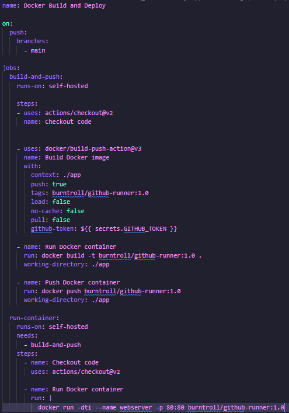
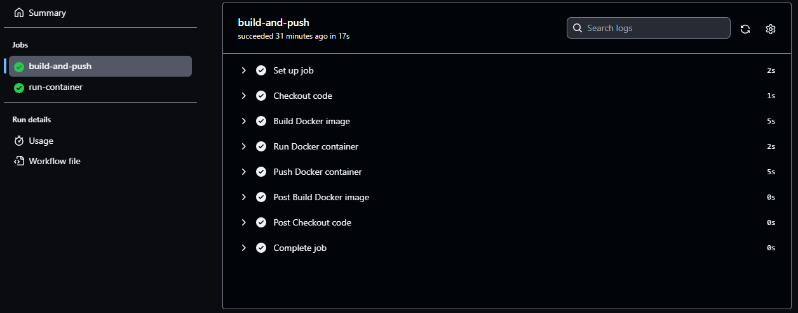

# DevOps - Github pipeline runner

This project is designed to demonstrate my abilities with GitHub Pipeline. It consists of a runner that listens to jobs and builds a Docker image, pushes it to Docker Hub, and deploys it on a website with Apache. The pipeline works only for the main branch, like a branch for deployment.

## Features

- Automated build and deployment of Docker images
- Continuous integration and testing with GitHub Actions
- Continuous deployment of website after each update

## Technologies Used

- Docker: used to build and deploy images
- GitHub Actions: Used to automate the testing process and ensure the script works in the Linux environment
- Apache: Used to deploy images to a website

## Contributing

Contributions to this project are welcome! Feel free to fork this repository and submit a pull request with your changes.

## Credits

This project was built by [Francisco Silva](https://github.com/Burntroll)

## License

This project is licensed under the [MIT License](https://opensource.org/licenses/MIT)

## Results

**Code**

**Pipeline**

**Docker**

**App**

